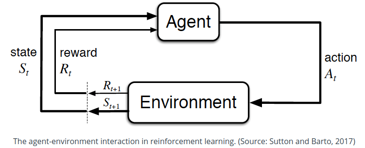

# 1. Reinforcement Learning
### 1.1 Basic Model

* Reinforcement Learning is about learning **Policy** from the interaction between agent and environment
* The interaction of agent and environment can be described as a sequence of 
  * $S_t, A_t, R_{t+1}, S_{t+1}, A_{t+1}, R_{t+2}, S_{t+2}, \dots $
  * It read as the agent at **State** $S_t$ made an **Action** $A_t$, the environments gave a instance feedback **Reward** $R_{t+1}$ and subsequent **State** $S_{t+1}$ based on **State** $S_t$ and the **Action** $A_t$.
* Most of the time, we are more interested for maximizing cumulative future rewards, such as win a game at last. So we denote cumulative rewards at time step $t$ as
$$G_t=R_{t+1}+\gamma R_{t+2} + \gamma^2 R_{t+3} \dots = \sum^{\infty}_{k=0}\gamma^k R_{t+k+1}, r\in[0, 1]$$

  * $G_t$ is also called **Return** at time step $t$
  * $\gamma$ is **Discount Rate**

* A **Policy** function, written like $p=\pi(s,a)$, describes how the agent act. It reads as the probability of agent to take action $a$ at state $s$.

### 1.2 State Value Function
* definition
$$v_{\pi}(s)=\mathop{\mathbb{E}}_{\pi}[G_t|S_t=s]$$

* read as the cumulative rewards from $S_t$ following policy $\pi$
* consider all following rewards are known in a finite episode
* can be used to evaluate policy, e.g.
$$\pi'>\pi \iff v_{\pi'}(s)\geq v_{\pi}(s), \forall s\in \mathcal{S}$$
  
  * $\pi'$ is better than $\pi$, when $v_{\pi'}(s)\geq v_{\pi}(s), \forall s\in \mathcal{S}$

### 1.3 Action Value Function
* definition
$$q_{\pi}(s,a)=\mathop{\mathbb{E}}_{\pi}[G_t|S_t=s, A_t=a]$$

* link state value with action

### 1.4 Bellman Equation
* Redefine state value function and action value function in an iterative way

* Bellman Expectation Equations

$$
v_\pi(s) = \sum_{a \in \mathcal{A}(s)}\pi(a|s)\sum_{s' \in \mathcal{S}, r\in\mathcal{R}}p(s',r|s,a)(r + \gamma v_\pi(s'))\nonumber
$$

$$
q_\pi(s,a) = \sum_{s' \in \mathcal{S}, r\in\mathcal{R}}p(s',r|s,a)(r + \gamma\sum_{a' \in \mathcal{A}(s')} \pi(a'|s') q_\pi(s',a'))\nonumber
$$

# 2. Q-Learning
* also called maximum SARS
* off-policy learning, use max(Q_next) to learn instead of using orignial policy $\pi$
### 2.2 Temporal Difference Learning
### 2.3 Convergency
* Bellman Operator
* Contraction Mappings

# 3. Deep Q Network
### 3.1 Architecture

### 3.2 Loss Function

# 4. Training Deep Q Network
* when hard copy from policy net to target net to frequent, e.g. every 4 learning steps, the training step will not be consistence due to my experiements. For example, one run will converge well, but some other run will not converge.

# References
* Udactiy Deep Reinforcement Learning Nanodegree
* Udacity Reinforcement Learning by Prof. Charles Isbell and Prof. Michael Littman
* Tutorials from MorvanZhou